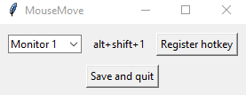

# MouseMove
Simple python script to move the mouse across the screens

## Default hotkeys:
**Alt+Shift+s** to open the settings window  
**Alt+Shift+e** to close the program  
**Alt+Shift+*MonitorNumber*** to move the mouse in the center of the monitor *MonitorNumber*

## Settings window 

How it works:
1. Select the monitor whose hotkey you want to change
2. Press the **Register hotkey** button
3. Press the keys
4. To apply the changes press the **Save and quit** button

## Installation:
1. From source code:
    - Install dependencies with: `pip3 install -r requirements.txt` (with **sudo** in Linux)
    - Run main.pyw (with **sudo** in Linux)
    - **(Linux only)** If you get the error `ModuleNotFoundError: No module named 'tkinter'` install the package python3-tk
2. See [releases][1] for standalone versions

### Actually tested in:
- Linux (Ubuntu 20.04 and Debian 10 Buster)
- Windows 10

[1]:https://github.com/MatteP99/MouseMove/releases
